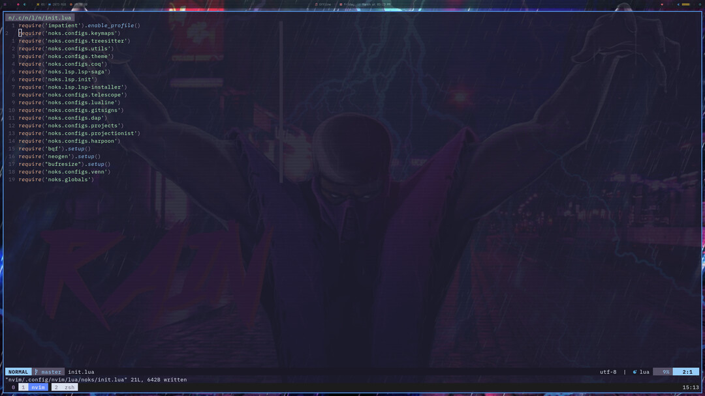
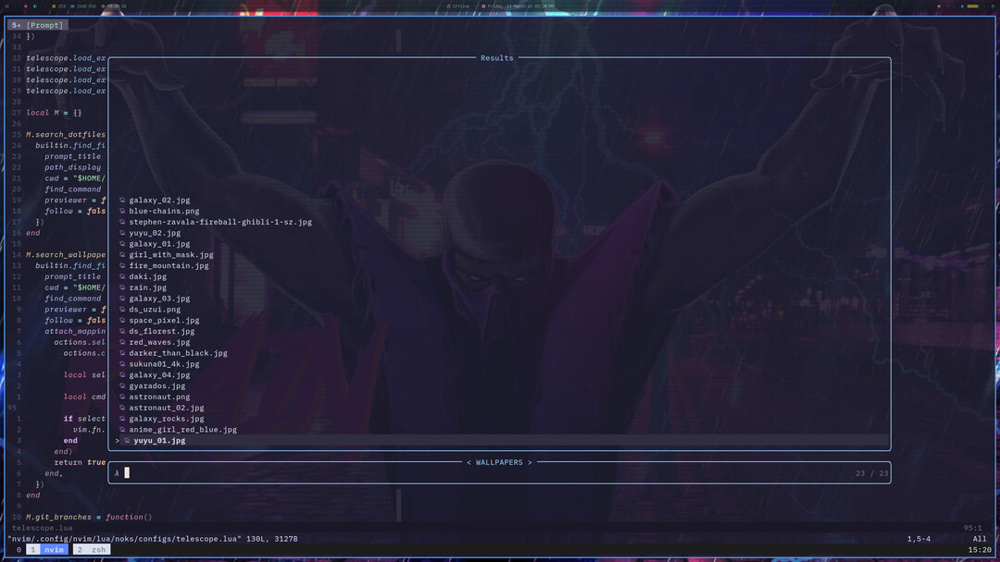
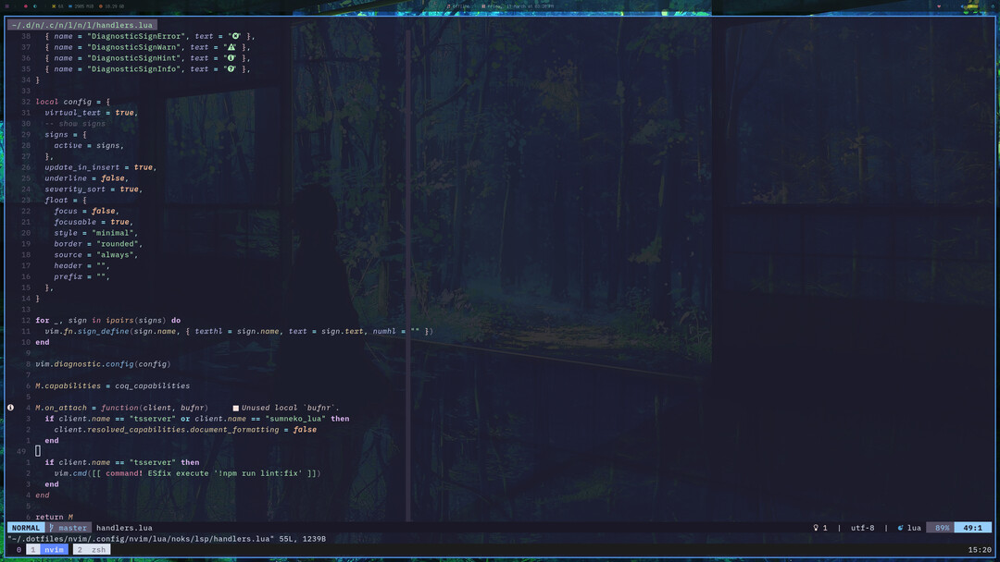

# Just my dotfiles  ( ͡❛ ᴗ ͡❛)  


### Features

- I change my config almost all the time, so feel free to see for yourself 😉

> 💥 For now scripts may be broken at any time, run at your own risk.


### Setup

Just clone the repo and execute the ```install.sh``` script

There are three setups, along with the linux distros that i use.

- arch / yay -- [EndeavourOS](https://endeavouros.com/)
- ubuntu / apt -- [Pop!_OS](https://pop.system76.com/) 
- mac / brew

Polybar setup is not part of these scripts yet.
I'm currently using [polybar-themes](https://github.com/adi1090x/polybar-themes) 

---

### Neovim / Desktop Screenshots

 
 
 
