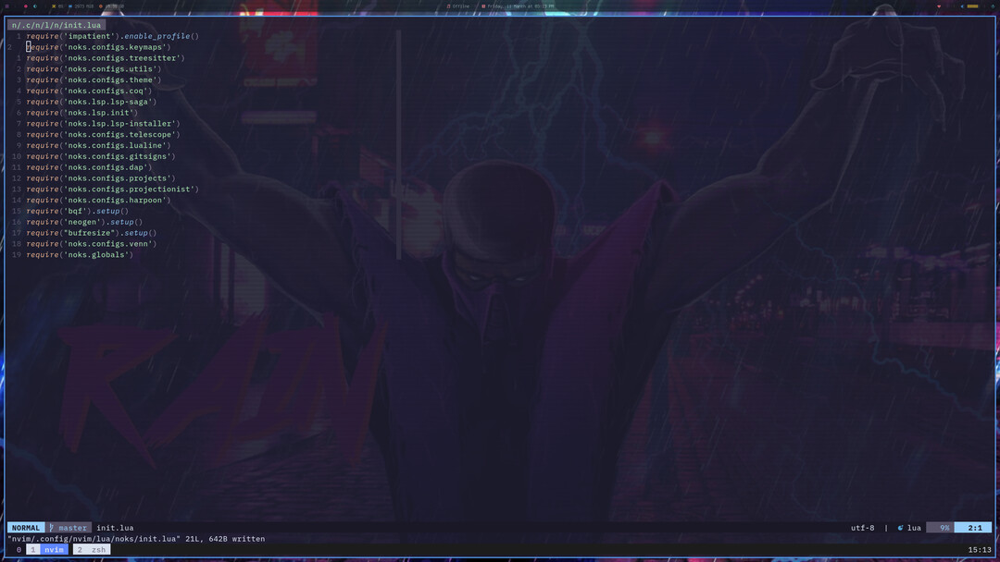
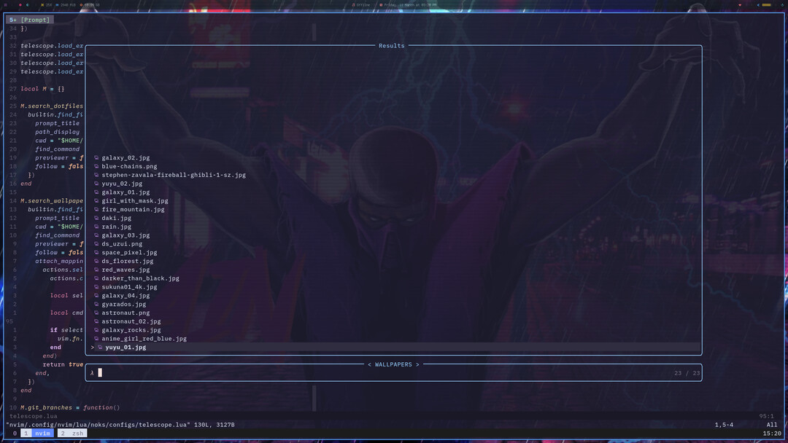
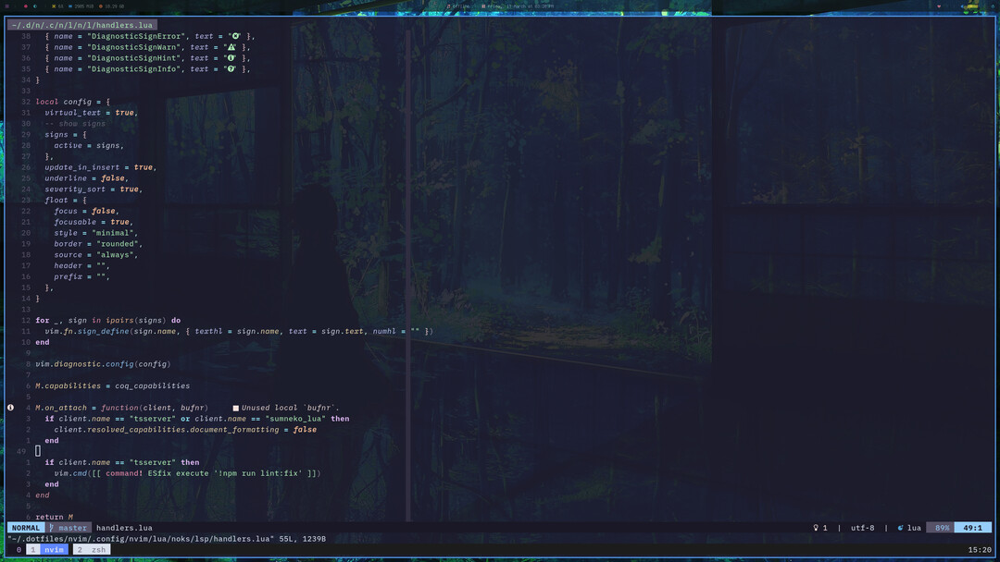

# Just my dotfiles  ( ͡❛ ᴗ ͡❛)  


### Features

- I change my config almost all the time, so feel free to see for yourself 😉


### Setup

#### macOS (fresh install)

One command — installs the Xcode Command Line Tools and Homebrew, clones this repo into `~/.dotfiles` and runs `install.sh`:

```sh
curl -fsSL https://raw.githubusercontent.com/n0ks/dotfiles/master/bootstrap.sh | bash
# with the GUI apps from Brewfile.apps, no prompts:
curl -fsSL https://raw.githubusercontent.com/n0ks/dotfiles/master/bootstrap.sh | bash -s -- --apps --yes
```

Already cloned? `./install.sh [flags]`. Every step is idempotent, so re-running only fills in what is missing.
A failing step doesn't stop the run; the summary at the end shows ✔/✘ per step and everything is logged
to `~/.dotfiles-setup.log`. Files that would block `stow` are moved to `~/.dotfiles-backup/<timestamp>/`.

| flag | |
| --- | --- |
| `--apps` / `--no-apps` | install (or not) `Brewfile.apps`; asks when omitted |
| `--yes`, `-y` | no prompts (implies `--no-apps` unless `--apps`) |
| `--only a,b` / `--skip a,b` | run only / skip some steps |
| `--list` | list the steps |

Steps: `xcode_clt homebrew brew_bundle brew_apps dotfiles fonts shell tmux runtimes neovim extras ssh github macos_defaults touchid_sudo`.

- `Brewfile` is the core CLI/dev tooling (always); `Brewfile.apps` the GUI apps (opt-in).
- Runtimes come from asdf + `zsh/.tool-versions`. Neovim is built from source (`NVIM_REF=stable` by default, skipped when the installed version already matches).
- Secrets and machine-only settings go in `~/.zshrc.local` (not versioned, `chmod 600`), sourced at the end of `.zshrc`.

Still manual:

- Xcode (App Store) and signing in to the App Store before `--apps` (needed for `mas` apps).
- `gh auth login` happens interactively in the `github` step (then the ssh key is uploaded and the private submodule is cloned). With `--yes` it's skipped: run `./install.sh --only github` later.
- Full Disk Access for the terminal if you want the Safari / reduce-motion defaults to stick.
- Corporate apps (Company Portal, Defender, GlobalProtect, Office, Teams) are managed by IT.

#### Linux

Clone the repo and run `./install.sh`. There are setups for the distros I use:

- arch / yay -- [EndeavourOS](https://endeavouros.com/)
- ubuntu / apt -- [Pop!_OS](https://pop.system76.com/)

Polybar setup is not part of these scripts yet.
I'm currently using [polybar-themes](https://github.com/adi1090x/polybar-themes)

---

### Neovim / Desktop Screenshots

 
 
 
